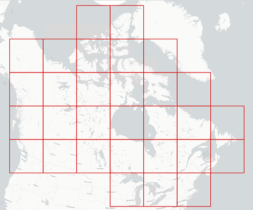

# Module 1
## Coverage Tiler (python module)
* Create a new python module that will allow creating a custom index based on a specific tile size (e.g 800000x800000). 
* Reuse the custom index to intersect with an existing tile coverage to create list of files.

 

> Spatial Reference System: EPSG:3979 (https://epsg.io/3979)

> Suggested Extent: Extent(-4152858, -3698040, 4235750, 4690568) or  Canadian Landmass Polygon 
(https://datacube-dev-data-public.s3.ca-central-1.amazonaws.com/store/canada.geojson )

## Output example: 
(https://datacube-dev-data-public.s3.ca-central-1.amazonaws.com/store/tiling50k.geojson)
## GitHub repo: 
(https://github.com/jfbourgon/nrcan-datacube)
## Git useful commands: 
(https://www.freecodecamp.org/news/10-important-git-commands-that-every-developer-should-know/)
