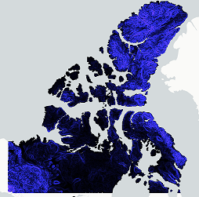
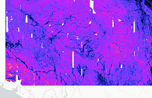
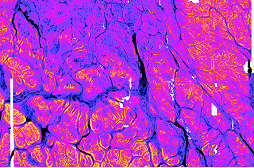

# Work Module 3
## Resampling decision matrix (using python, R or GDAL)

## Work Description:
* explore different resampling methods when creating cogs
* generate statistics on all overview image levels
* compare and contrast results statistically and visually
* make recommendations
* can be done using R or GDAL
* capture work, code, logic, findings in jupyter notebook
## Purpose of work
This work serves two purposes:
1. To provide the data-cube team with a decision matrix to assist in the selection of the proper sampling techniques applied during cog creation and,
2. To provide the student with an opportunity to learn about 
   * spatial resampling, 
   * use and interpretation of image statistics
   * resampling affect on cog creation and data visualisation at multiple levels

> All suggestions, questions, modifications and findings from the student are welcome throughout the lifecycle of this work.  

### Resampling Error Examples
| Over smoothing | Swathes and Void Edges | 
| --- | --- |
|  |    |
### Working on local computer
Any work done on local computer may be performed on a representative sample of the image to ensure image size is not too large.  Images can be clipped, or single tiles may be used or any other sampling technique preferred or developed by student.
### Decision Matrix – Template 
> Please modify / improve, please store actual data in spreadsheet or csv

| Catalog | Data sample image, bbox or tile | Data Type | Pixel size | Data distribution | Data distribution (amount <> ND as %) | Data representation | Data min | Data max | Resampling options | Resampling tested | Resampling recommendation
| --- | --- | --- | --- | --- | --- | --- | --- | --- | --- | --- | --- |
| canlad | canlad-2008-cog.tif | byte | 30 | sporadic | 0.1 | thematic | 1 | 2 | mode, nearest neighbour | mode, nearest neighbour | nearest neighbour
| cdem | <tile or bbox> |   |   | continuous |   | athematic |   |   | all |   |   
| others to be chosen |   |   |   |   |   |   |   |   |   |   |   
| others to be chosen |   |   |   |   |   |   |   |   |   |   |   

## Example code for creating individual overviews
### First overview from original image
    gdaladdo -r <resampling_method> -ro <file_name> --config COMPRESS_OVERVIEW LZW 2 
### Second overview from first overview
    gdaladdo -r <resampling_method> -ro <first_overview_file_name> --config COMPRESS_OVERVIEW LZW 4 
### Third overview from second overview
    gdaladdo -r <resampling_method> -ro <second_overview_file_name> --config COMPRESS_OVERVIEW LZW 8 
### Forth overview from third overview
    gdaladdo -r <resampling_method> -ro <third_overview_file_name> --config COMPRESS_OVERVIEW LZW 16 
### Fifth overview from forth overview
    gdaladdo -r <resampling_method> -ro <fourth_overview_file_name> --config COMPRESS_OVERVIEW LZW 32 
### Sixth overview from fifth overview
    gdaladdo -r <resampling_method> -ro <fifth_overview_file_name> --config COMPRESS_OVERVIEW LZW 64 
### Seventh overview from sixth overview
    gdaladdo -r <resampling_method> -ro <sixth_overview_file_name> --config COMPRESS_OVERVIEW LZW 128 
### Eighth overview from seventh overview
    gdaladdo -r <resampling_method> -ro <seventh_overview_file_name> --config COMPRESS_OVERVIEW LZW 256 

## Example code for generating statistics including histogram
    gdalinfo –stats -hist <file_name> > <stats_file_name>
## Example table to store results 
> Please modify / expand / improve, please store actual data in spreadsheet or csv

| Catalog | image | cols | rows | 1 pixels | 2 pixels | total pixels | null pixels | classified pixels | % classified
| --- | --- | --- | --- | --- | --- | --- | --- | --- | --- |
| canlad | original cog | 178401 | 119101 | 13470165 |7773181 | 2.1248E+10 | 2.123E+10 | 21243346 | 0.10%
canlad|nearest 256|697|466|216|129|324802|324457|345|0.11%
canlad|mode 256|697|466|6165|19186|324802|299451|25351|8.47%
etc…|||||||||

## Example code for creating cogs with all 8 overviews using resampling
    gdaladdo -r <resampling_method> <file_name> 2 4 8 16 32 64 128 256
## Data visualisation 
Data visualisation may be done using matplotlib module of python or in qgis or other method preferred or recommended by student.  Different resampling at different zoom levels should be compared from a single cog and from individual overview files if possible

    ## A python way to inspect an overview portion of a cog image
    #from https://automating-gis-processes.github.io/CSC/notebooks/L5/read-cogs.html
    import rasterio
    import matplotlib.pyplot as plt
    import numpy as np
    ## %matplotlib inline used for jupyter notebooks to plot, for python shell use plt.show()
    
    url="http://datacube-prod-data-public.s3.ca-central-1.amazonaws.com/store/dem/cdem/cdem-25-dem.tif"
    cog=rasterio.open(url)
    # print out size of original image
    print(cog.shape)
    # list of overviews
    overviews=cog.overviews(1)
    # smallest scale overview
    ov_01=overviews[-1]
    # decimation factor
    print(ov_01)
    # get overview based on overview request parameters
    thumbnail=cog.read(1,out_shape=(1,int(cog.height/ov_01),int(cog.width//ov_01)))
    # print out array of raster
    print('array type: ',type(thumbnail))
    print(thumbnail)
    #print out size of raster
    print(thumbnail.shape)
    #plot thumbnail
    plt.imshow(thumbnail)
    plt.colorbar()
    plt.title('Overview - cog {}'.format(thumbnail.shape))
    plt.xlabel('Column #')
    plt.ylabel('Row #')
    plt.show()
